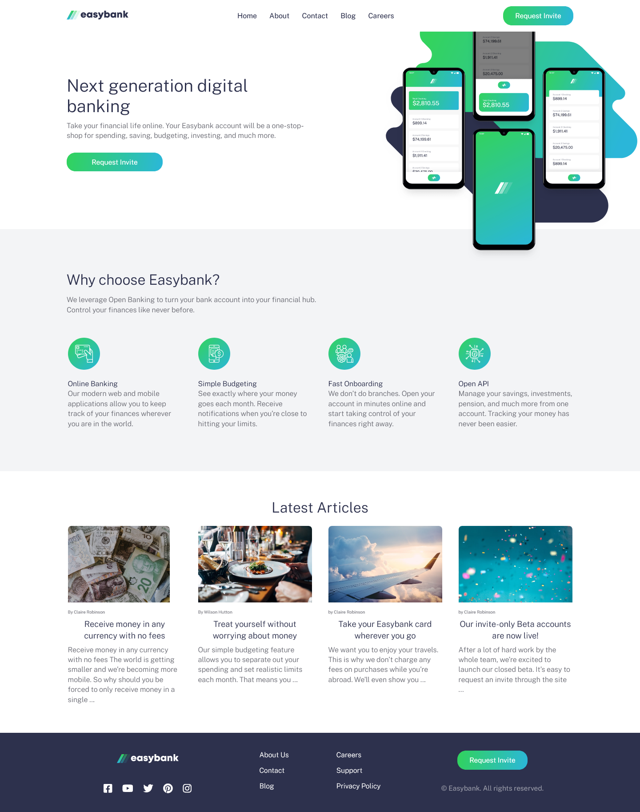

# Frontend Mentor - Easybank landing page solution

This is a solution to the [Easybank landing page challenge on Frontend Mentor](https://www.frontendmentor.io/challenges/easybank-landing-page-WaUhkoDN). Frontend Mentor challenges help you improve your coding skills by building realistic projects. 

## Table of contents

- [Overview](#overview)
  - [The challenge](#the-challenge)
  - [Links](#links)
- [My process](#my-process)
  - [Built with](#built-with)
  - [What I learned](#what-i-learned)
  - [Continued development](#continued-development)
  - [Useful resources](#useful-resources)
- [Author](#author)
- [Acknowledgments](#acknowledgments)

## Overview

### The challenge

Users should be able to:

- View the optimal layout for the site depending on their device's screen size
- See hover states for all interactive elements on the page

### Links

- Solution URL: [GitHub Repo](https://joaohass.github.io/easybank-landing-page/)
- Live Site URL: https://joaohass.github.io/easybank-landing-page/

## My process

### Built with

- Semantic HTML5 markup
- CSS custom properties
- Flexbox
- CSS Grid
- Mobile-first workflow

### What I learned 📚 

This project helped me a lot to get a better picture of when and why to use flexbox or grid, it also offered a good challenge at dealing with absolute positioning. Absolute positioning may sound simple when you try a basic example, but can become troublesome when applying in a real project, specially because it has to scale properly through different screen sizes, it has to be responsive, users expect the website to adapt to their needs, and not the way around.

Not only that, but I also tried to make the project more accessible to every kind of user, using proper aria-labels, screen-reader only texts, tabindex, proper contrast ratio, and more.

The estimated time to conclude this project was about 7 hours or so, but I experimented different things and tried to apply different perspectives along the way, so it took me a little bit longer to conclude the project, somewhere around 8 to 9 hours. It wasn't a huge of a difference, which was a trade-off for the new things I learned, so I'm satisfied with my results.

### Continued development

I'm very comfortable at dealing with regular html/css, so I'll start to go for bigger projects, that require more planning and more attention to detail, specially if it has ``position: absolute`` and a way to recycle classes (a topic that I'm thinking to dive in with Tailwind).

I'm also enjoying to make accessible websites, so this is another topic that I want to learn more. The internet should be accessible to everyone, doesn't it? 😄

### Useful resources

- [Linearly Scale font-size](https://css-tricks.com/linearly-scale-font-size-with-css-clamp-based-on-the-viewport/) - CSS-Tricks is an awesome place to find good stuff, and I was wondering how to make font-size responsive as well, and then I found this gem.

## Author

- Github - [João Hass](https://github.com/joaoHass)
- Frontend Mentor - [@joaoHass](https://www.frontendmentor.io/profile/joaoHass)
- Linkedin - [João Pedro Hass Calciolari](https://www.linkedin.com/in/joaohass/?originalSubdomain=br)

## Acknowledgments

Thanks to the people from Kevin Kewell's community, such an amazing and helpful community.
